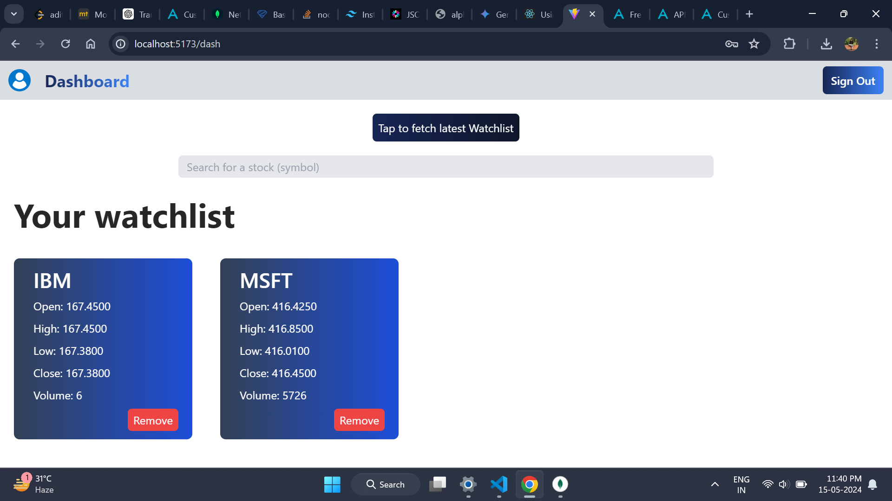
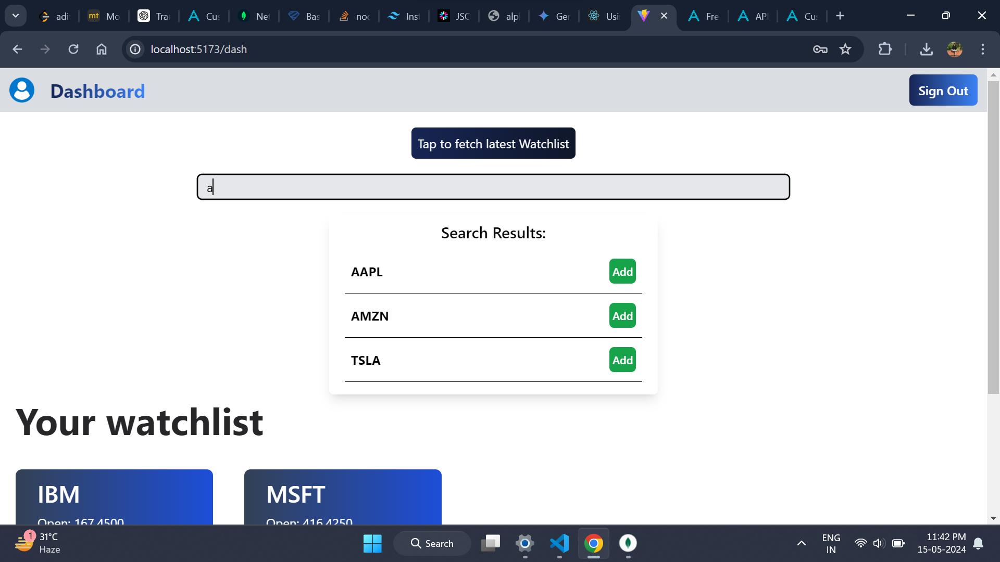
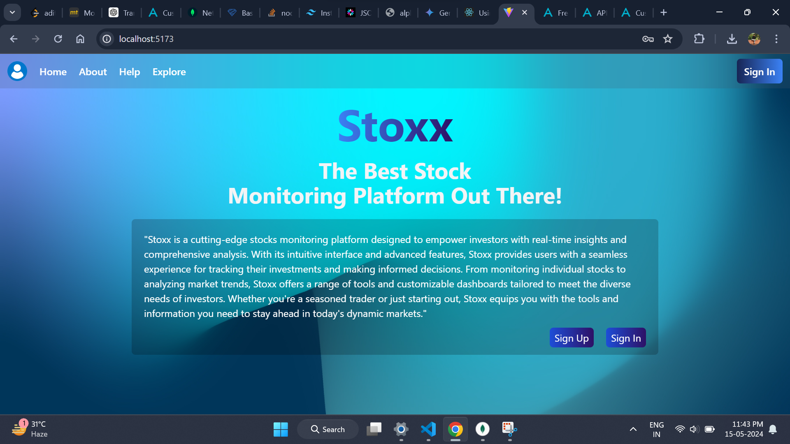
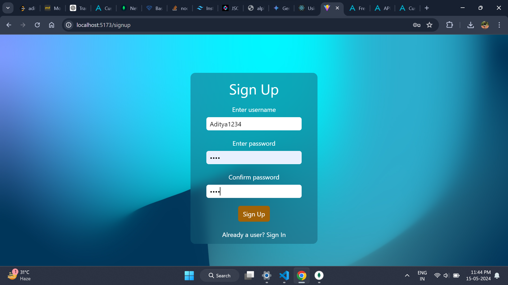

# Stock Monitoring App

A stock monitoring app to track latest price of your selected stocks in your watchlist
Techstack used : {MongoDB,Mongoose,Express and NodeJS,ReactJS,TailwindCSS and typescript/javascript}

Steps to run this project locally : 

1.Clone this repository
2.You need run the server locally at your machine by doing => node backend/index.js
3.Open another terminal and activate the react-app by doing => cd frontend => npm run dev
4.You need your own instance of MongoDB, so please create your own cluster and replace the link in backend/db.js => mongoose.connect( Your connection String URL to connect)
5.You might need to generate your own API to fetch results, so please do that, you can use my API but it's pretty useless

